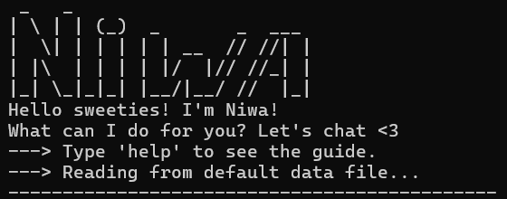
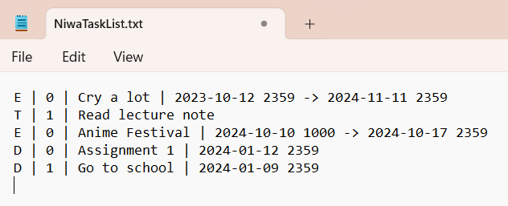
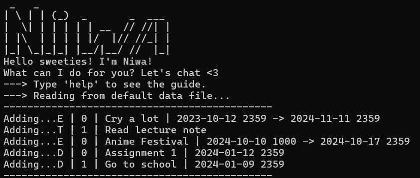

# Niwa User Guide

## Table of Contents
1. [Introduction](#introduction)
2. [Quick Start](#quick-start)
3. [Features](#features)
   - [1. Print User Guide](#1-print-user-guide-help)
   - [2. Echo a String](#2-echo-a-string-echo-string_to_echo)
   - [3. Add a To-Do](#3-add-a-to-do-todo)
   - [4. Add a Deadline](#4-add-a-deadline-deadline)
   - [5. Add an Event](#5-add-an-event-event)
   - [6. List Tasks](#6-list-tasks-list)
   - [7. Find Tasks by Keyword](#7-find-tasks-by-keyword-find)
   - [8. Mark a Task as Done](#8-mark-a-task-as-done-mark)
   - [9. Unmark a Task](#9-unmark-a-task-unmark)
   - [10. Delete a Task](#10-delete-a-task-delete)
   - [11. Clear All Tasks](#11-clear-all-tasks-clear)
   - [12. Save Task List](#12-save-task-list-save)
   - [13. Read Tasks from a File](#13-read-tasks-from-a-file-read)
   - [14. End the Chat](#14-end-the-chat-bye)
4. [Additional Notes](#additional-notes)

## Introduction
Niwa chatbot is your best friend, who will help you managing all your tasks! Given below are instructions on how to talk to me.
Let's chat!

*This user guide is written based on the [AB-3 User Guide](https://se-education.org/addressbook-level3/UserGuide.html)*

### Quick start
1. Ensure you have Java 17 or above installed in your Computer.
2. Download the latest .jar file from [here](https://github.com/DanLinhHuynh-Niwashi/ip/releases/tag/v2.0).
3. Copy the file to the folder you want Niwa to stay in.
4. Open a command terminal, cd into the folder you put the jar file in, and use the ```java -jar Niwa.jar``` command to meet Niwa!
   
## Features
> **&#9432;** **NOTES ON THE COMMAND FORMAT:**
>- Words in UPPER_CASE are the parameters to be supplied by the user.
>- Parameters can be in any order.
>- Extraneous parameters for commands that do not take in parameters (such as help, list, bye and clear) will **NOT** be ignored.

Here’s a list of available commands along with their expected outputs:

---
### 1. Print user guide: **`help`**
**Syntax:** **`help`**

**Description:** Displays a shortened user guide.

---
### 2. Echo a string: **`echo STRING_TO_ECHO`**
**Syntax:** **`echo STRING_TO_ECHO`**

**Description:** Echo the provided string.

**Example:** 
- `echo Halo bae <3`

---
### 3. Add a to-do: **`todo`**
**Syntax:** **`todo DESCRIPTION`**

**Description:** Add a new to-do to your list.

**Example:**
- `todo Buy groceries` will add a new to-do `Buy groceries` to your list.

---
### 4. Add a deadline: **`deadline`**
**Syntax:** **`deadline DESCRIPTION /by YYYY-MM-DD HHMM`**

**Description:** Add a new deadline to your list.
- If you don't input the **`HHMM`** field, Niwa will automatically set the time to *23:59*.
  
**Example:** 
- `deadline Submit assignment /by 2024-10-01 1700` will add a new deadline `Submit assignment` to your list, which dues on `2024-10-01 1700`.
- `deadline Submit quiz /by 2024-10-01` will add a new deadline `Submit quiz` to your list, which dues on `2024-10-01 2359`.

---
### 5. Add an event: **`event`**
**Syntax:** **`event DESCRIPTION /from YYYY-MM-DD HHMM /to YYYY-MM-DD HHMM`**

**Description:** Add a new event to your list.
- If you don't input the **`HHMM`** field, Niwa will automatically set the time to *23:59*.

**Example:** 
- `event Groceries day /from 2024-10-01 1300 /to 2024-10-01 1400` will add a new event `Groceries day` from `2024-10-01 1300` to `2024-10-01 1400` to your list.

---
### 6. List tasks: **`list`**
**Syntax:** **`list`**

**Description:** Display all current tasks in the list.

---
### 7. Find tasks by Keyword: **`find`**
**Syntax:** **`find KEYWORD`**

**Description:** Find tasks containing the specified keyword.
- The keyword is not case-sensitive.

**Example:** 
- `find groceries` will display a list of tasks that contains the keyword `groceries`.

---
### 8. Mark a task as Done: **`mark`**
**Syntax:** **`mark TASK_INDEX`**

**Description:** Mark the task at the specified index as completed.

**Example:** 
- `mark 1` will mark the task at index `1` as done.

---
### 9. Unmark a task: **`unmark`**
**Syntax:** **`unmark TASK_INDEX`**

**Description:** Unmark the task at the specified index, indicating it is not completed.

**Example:** 
- `unmark 1` will unmark the task at index `1`.

---
### 10. Delete a task: **`delete`**
**Syntax:** **`delete TASK_INDEX`**

**Description:** Delete the task at the specified index from your list.

**Example:** 
- `delete 1` will delete the task at index `1`.

---
### 11. Clear all tasks: **`clear`**
**Syntax:** **`clear`**

**Description:** Clear all tasks in the list.

**Tips:** You will be prompted to confirm this action.


---
### 12. Save task list: **`save`**
**Syntax:** **`save FILE_PATH.txt`**

**Description:** Save the current task list to the specified file path.
- If the file doesn't exists, Niwa will create a new file for you.
- If the file exists, Niwa will overwrite the file with your task list.
- The output file will have this format:
```
to-do: T | TASK_STATUS (0 as undone, 1 as done) | TASK_DESCRIPTION
deadline: D | TASK_STATUS (0 as undone, 1 as done) | TASK_DESCRIPTION | DUE_DATE
event: E | TASK_STATUS (0 as undone, 1 as done) | TASK_DESCRIPTION | START_DATE -> END_DATE
```

**Example:** 
- `save tasks.txt` will save your task list to `tasks.txt`.
- `save path/tasks.txt` will save your task list to `path/tasks.txt`.

---
### 13. Read tasks from a file: **`read`**
**Syntax:** **`read FILE_PATH.txt`**

**Description:** Read tasks from the specified file and add them to your task list.
- Each task in the file should be written in one row, with this format:
```
to-do: T | TASK_STATUS (0 as undone, 1 as done) | TASK_DESCRIPTION
deadline: D | TASK_STATUS (0 as undone, 1 as done) | TASK_DESCRIPTION | yyyy-MM-dd [HHmm]
event: E | TASK_STATUS (0 as undone, 1 as done) | TASK_DESCRIPTION | yyyy-MM-dd [HHmm] -> yyyy-MM-dd [HHmm]
```
- Tasks with wrong format will be passed.

**Example:** 
- `read tasks.txt` will read the task list from `tasks.txt`.
- `read path/tasks.txt` will read the task list from `path/tasks.txt`.

---
### 14. End the chat: **`bye`**
**Syntax:** **`bye`**

**Description:** End the chat.

## Additional Notes
- The task list is automatically saved to a default file named `NiwaTaskList.txt` whenever it changes. You should find your data folder in your working directory.
  
  
- Niwa will read task information from the default file path when she starts running.
  
  
